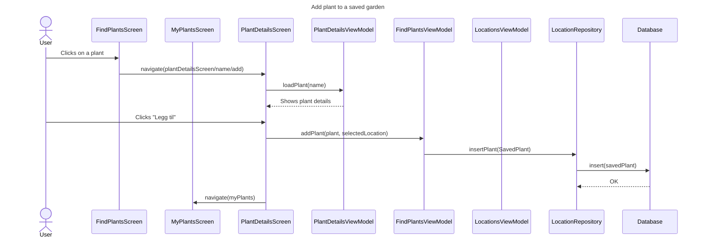
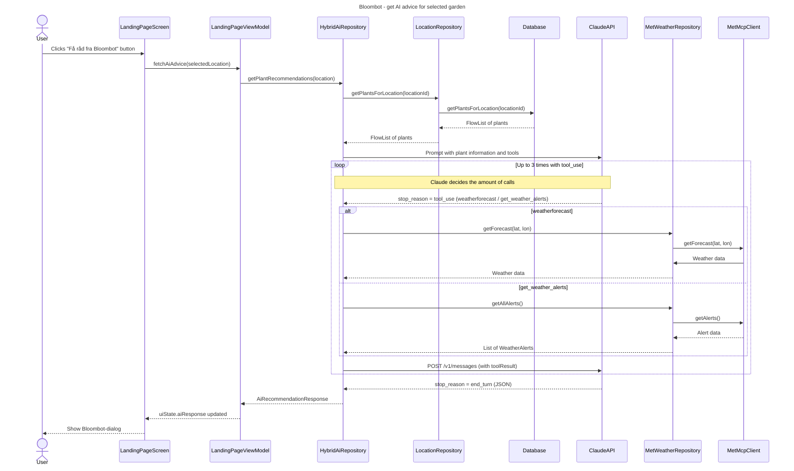

## Sequence diagram

```mermaid
---
title: Add plant to a saved garden
---
sequenceDiagram
    actor User
    participant FindPlantsScreen
    participant MyPlantsScreen
    participant PlantDetailsScreen
    participant PlantDetailsViewModel
    participant FindPlantsViewModel
    participant LocationsViewModel
    participant LocationRepository
    participant Database
    

    User->>FindPlantsScreen: Clicks on a plant
    FindPlantsScreen->>PlantDetailsScreen: navigate(plantDetailsScreen/name/add)
    PlantDetailsScreen->>PlantDetailsViewModel: loadPlant(name)
    PlantDetailsViewModel-->>PlantDetailsScreen: Shows plant details
    User->>PlantDetailsScreen: Clicks "Legg til"
    PlantDetailsScreen->>FindPlantsViewModel: addPlant(plant, selectedLocation)
    FindPlantsViewModel->>LocationRepository: insertPlant(SavedPlant)
    LocationRepository->>Database: insert(savedPlant)
    Database-->>LocationRepository: OK
    PlantDetailsScreen->>MyPlantsScreen: navigate(myPlants)
```
## Sequence diagram

```mermaid
---
title: Bloombot - get AI advice for selected garden
---
sequenceDiagram
    actor User
    participant LandingPageScreen
    participant LandingPageViewModel
    participant HybridAiRepository
    participant LocationRepository
    participant Database
    participant ClaudeAPI
    participant MetWeatherRepository
    participant MetMcpClient

    User->>LandingPageScreen: Clicks "Få råd fra Bloombot" button
    LandingPageScreen->>LandingPageViewModel: fetchAiAdvice(selectedLocation)
    LandingPageViewModel->>HybridAiRepository: getPlantRecommendations(location)
    HybridAiRepository->>LocationRepository: getPlantsForLocation(locationId)
    LocationRepository->>Database: getPlantsForLocation(locationId)
    Database-->>LocationRepository: FlowList of plants
    LocationRepository-->>HybridAiRepository: FlowList of plants
    HybridAiRepository->>ClaudeAPI: Prompt with plant information and tools
    loop Up to 3 times with tool_use
        note over ClaudeAPI,HybridAiRepository: Claude decides the amount of calls
        ClaudeAPI-->>HybridAiRepository: stop_reason = tool_use (weatherforecast / get_weather_alerts)
        alt weatherforecast
            HybridAiRepository->>MetWeatherRepository: getForecast(lat, lon)
            MetWeatherRepository->>MetMcpClient: getForecast(lat, lon)
            MetMcpClient->>MetWeatherRepository: Weather data
            MetWeatherRepository-->>HybridAiRepository: Weather data
        else get_weather_alerts
            HybridAiRepository->>MetWeatherRepository: getAllAlerts()
            MetWeatherRepository->>MetMcpClient: getAlerts()
            MetMcpClient-->>MetWeatherRepository: Alert data
            MetWeatherRepository-->>HybridAiRepository: List of WeatherAlerts
        end
        HybridAiRepository->>ClaudeAPI: POST /v1/messages (with toolResult)
    end
    ClaudeAPI-->>HybridAiRepository: stop_reason = end_turn (JSON)
    HybridAiRepository-->>LandingPageViewModel: AiRecommendationResponse
    LandingPageViewModel-->>LandingPageScreen: uiState.aiResponse updated
    LandingPageScreen-->>User: Show Bloombot-dialog
```
## Use case diagram

