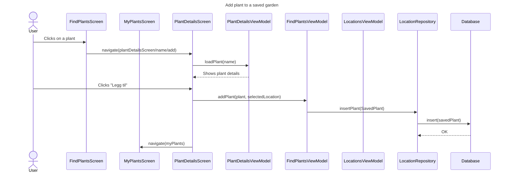
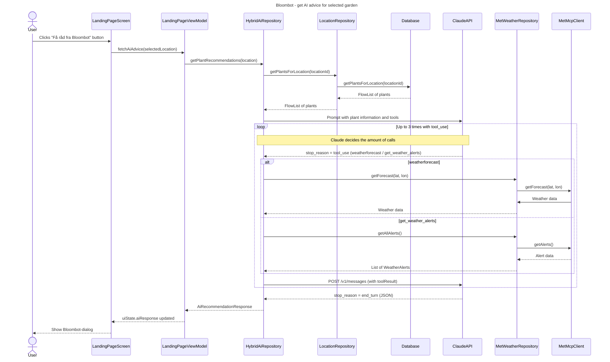

## Sequence diagram

```mermaid
---
title: Add plant to a saved garden
---
sequenceDiagram
    actor User
    participant FindPlantsScreen
    participant MyPlantsScreen
    participant PlantDetailsScreen
    participant PlantDetailsViewModel
    participant FindPlantsViewModel
    participant LocationsViewModel
    participant LocationRepository
    participant Database
    

    User->>FindPlantsScreen: Clicks on a plant
    FindPlantsScreen->>PlantDetailsScreen: navigate(plantDetailsScreen/name/add)
    PlantDetailsScreen->>PlantDetailsViewModel: loadPlant(name)
    PlantDetailsViewModel-->>PlantDetailsScreen: Shows plant details
    User->>PlantDetailsScreen: Clicks "Legg til"
    PlantDetailsScreen->>FindPlantsViewModel: addPlant(plant, selectedLocation)
    FindPlantsViewModel->>LocationRepository: insertPlant(SavedPlant)
    LocationRepository->>Database: insert(savedPlant)
    Database-->>LocationRepository: OK
    PlantDetailsScreen->>MyPlantsScreen: navigate(myPlants)
```
## Sequence diagram

```mermaid
---
title: Bloombot - get AI advice for selected garden
---
sequenceDiagram
    actor User
    participant LandingPageScreen
    participant LandingPageViewModel
    participant HybridAiRepository
    participant LocationRepository
    participant Database
    participant ClaudeAPI
    participant MetWeatherRepository
    participant MetMcpClient

    User->>LandingPageScreen: Clicks "Få råd fra Bloombot" button
    LandingPageScreen->>LandingPageViewModel: fetchAiAdvice(selectedLocation)
    LandingPageViewModel->>HybridAiRepository: getPlantRecommendations(location)
    HybridAiRepository->>LocationRepository: getPlantsForLocation(locationId)
    LocationRepository->>Database: getPlantsForLocation(locationId)
    Database-->>LocationRepository: FlowList of plants
    LocationRepository-->>HybridAiRepository: FlowList of plants
    HybridAiRepository->>ClaudeAPI: Prompt with plant information and tools
    loop Up to 3 times with tool_use
        note over ClaudeAPI,HybridAiRepository: Claude decides the amount of calls
        ClaudeAPI-->>HybridAiRepository: stop_reason = tool_use (weatherforecast / get_weather_alerts)
        alt weatherforecast
            HybridAiRepository->>MetWeatherRepository: getForecast(lat, lon)
            MetWeatherRepository->>MetMcpClient: getForecast(lat, lon)
            MetMcpClient->>MetWeatherRepository: Weather data
            MetWeatherRepository-->>HybridAiRepository: Weather data
        else get_weather_alerts
            HybridAiRepository->>MetWeatherRepository: getAllAlerts()
            MetWeatherRepository->>MetMcpClient: getAlerts()
            MetMcpClient-->>MetWeatherRepository: Alert data
            MetWeatherRepository-->>HybridAiRepository: List of WeatherAlerts
        end
        HybridAiRepository->>ClaudeAPI: POST /v1/messages (with toolResult)
    end
    ClaudeAPI-->>HybridAiRepository: stop_reason = end_turn (JSON)
    HybridAiRepository-->>LandingPageViewModel: AiRecommendationResponse
    LandingPageViewModel-->>LandingPageScreen: uiState.aiResponse updated
    LandingPageScreen-->>User: Show Bloombot-dialog
```
## Use case diagram

## Class diagram

```mermaid
---
title: Bloombot - get AI advice for selected garden
---

classDiagram-v2


class SavedLocation {
    <<model.location>>
    Long id
    String name
    Double lat
    Double lon
    String address
    Int zone
}

class SavedPlant {
    Long id
    Long locationId
    String name
    Set~SoilType~ soil
    Set~LightType~ light
    Float waterPerWeek
    Set~Int~ plantingMonth
    Int climateZone
    Boolean hasBeenWatered
    Int daysSinceWatered
    Int maxDaysWithoutWater
    Int imageRes
    String description
    Long lastWateredDate
    Long lastFertilizationDate
}
class PlantInfo {
    String name
    Set~SoilType~ soil
    Set~LightType~ light
    Float waterPerWeek
    Set~Int~ plantingMonth
    Int climateZone
    Boolean hasBeenWatered
    Int daysSinceWatered
    Int maxDaysWithoutWater
    Int imageRes
    String description
}

class FrostDataSource{
    getNearestStation(lat: Double, lon: Double, clientId: String): Source
    getPrecipitationSinceLastUsed(
    lat: Double,
    lon: Double,
    clientId: String,
    lastWatered: String
): Map<String, Double>
}

class WeatherForecast {
    <<data.mcp>>
}

class WeatherAlert {
    <<data.mcp>>
    Color color
    Boolean isDangerousForPlant(Boolean)
}

class WeatherUiState {
    <<ui.landingpage>>
    String temperature
    String precipitation
    String description
    String iconName
}

class LandingPageUiState {
    <<ui.landingpage>>
    +Map~Long,WeatherUiState~ locationForecasts
    +Boolean isWeatherLoading
    +Map~Long,List~WeatherAlert~~ locationAlerts
    +Boolean isAlertsLoading
    +AiRecommendationResponse? aiResponse
    +Boolean isAiLoading
    +Boolean showInfoDialog
}
class MapUiState {
    <<ui.map>>
    +Double centerLng
    +Double centerLat
    +Double zoom
    +String searchQuery
    +List~SearchSuggestion~ suggestions
    +List~WeatherAlert~ weatherAlerts
    +List~WeatherAlert~ locationAlerts
    +Boolean isAlertLoading
    +Double? userLat
    +Double? userLon
    +Boolean liveLocationPending
    +Boolean showLiveLocationConfirm
    +Boolean isSaving
}

class SoilType {
    <<enumeration>>
    SOIL
    CHALK
    CLAY
    LOAM
    SAND
}

class LightType {
    <<enumeration>>
    SHADE
    PARTIAL
    FULL
}

class SavedLocationDao {
    <<interface>>
    insert(SavedLocation)
    delete(SavedLocation)
    update(SavedLocation)
    getAllLocations() : Flow~List~SavedLocation
}
SavedLocation --> SavedLocationDao
class SavedPlantDao {
    <<interface>>
    insert(SavedPlant) : Long
    delete(SavedPlant)
    update(SavedPlant)
    getPlantsForLocation(Long) : +Flow~List~SavedPlant
    getAllPlants() : +Flow~List~SavedPlant
}


class AppDatabase {
    <<abstract>>
    +SavedLocationDao savedLocationDao()
    +SavedPlantDao savedPlantDao()
    +AppDatabase getDatabase(Context)$
}


class LocationRepository {
    +Flow~List~SavedLocation~~ allLocations
    insertLocation(SavedLocation) : Long
    deleteLocation(SavedLocation)
    updateLocation(SavedLocation)
    insertPlant(SavedPlant)
    deletePlant(SavedPlant)
    updatePlant(SavedPlant)
    getPlantsForLocation(Long) : Flow~List~SavedPlant~~
    getAllPlants() : Flow~List~SavedPlant~~
}


class PlantRepository {
        initiatePlants() : List~PlantInfo~
        recommendPlants(SavedLocation, List~SavedPlant~) : List~PlantInfo~
        notRecommendedPlants(SavedLocation, List~SavedPlant~) : List~PlantInfo~
    }

class PlantDataSource {
    fetchPlants() : List~PlantInfo~ 
    mapToPlant(List~String~) : Private PlantInfo
    normalizeName(String) : Private String
}


class ClaudeApi {
    <<interface>>
    sendMessage(String, ClaudeRequest) : ClaudeResponse 
}

class HybridAiRepository {
    -MODEL_NAME$
    -MAX_TOOL_LOOPS$
    -TOOL_NAME_WEATHER_FORECAST$
    -TOOL_NAME_WEATHER_ALERTS$
    +List~SavedPlant~ getPlantData(SavedLocation, LocationRepository)
    +String getPlantTxt(SavedLocation, LocationRepository)
    +AiRecommendationResponse getPlantRecommendations(SavedLocation)
    +AiRecommendationResponse getFuturePlantRecommendations(SavedLocation)
}


class MetMcpClient {
    connect()
    getForecast(Double, Double) : String
    getAlerts() : String
}
class MetWeatherRepository {
        getForecast(Double, Double) : String
        getParsedForecast(String) : WeatherForecast
        getAllAlerts() : List~WeatherAlert~
        parseAlerts(String) : List~WeatherAlert~
        isPointInPolygon(Double, Double, List) : Boolean
    }


class FrostRepository {
    +Map~String, Double~ getPrecipitationSinceLastUsed(Double, Double, String)
}

class LocationsViewModel {
        StateFlow~List~SavedLocation~~ savedLocations
        StateFlow~SavedLocation~ selectedLocation
        StateFlow~Boolean~ showMaxLocationsDialog
        selectLocation(SavedLocation)
        updateSelectedLocationName(String)
        onAddLocationClicked() : Boolean
        dismissMaxLocationsDialog()
    }


class MainActivity {
    onCreate()
}

class FindPlantsViewModel {
    StateFlow~List~PlantDetails~~ plants
    StateFlow~List~PlantDetails~~ notRecommendedPlants
    addPlant(PlantDetails, SavdLocation)
    loadRecommendedPlants(SavedLocation)
    clearPlants()
}


class SavedPlacesViewModel {
    +StateFlow~List~SavedLocation~~ savedLocations
    +StateFlow~SavedLocation~ selectedLocation
    +StateFlow~Boolean~ showMaxLocationsDialog
    +void selectLocation(SavedLocation)
    +void addLocation(SavedLocation)
    +void updateLocation(SavedLocation)
    +void updateSelectedLocationName(String)
    +Boolean onAddLocationClicked()
    +void dismissMaxLocationsDialog()
}


class LandingPageViewModel {
    StateFlow~LandingPageUiState~ uiState
    fetchAiAdvice(SavedLocation)
    fetchFutureAiAdvice(SavedLocation)
    dismissAiAdvice()
    showInfoDialog()
    dismissInfoDialog()
    loadDataForLocations(List~SavedLocation~)
}


class MapViewModel {
    StateFlow~MapUiState~ uiState
    updateUserPosition(Double, Double)
    requestLiveLocationSave()
    String getAddress(Double, Double, Context) : String
    confirmSaveLiveLocation(Context)
    dismissLiveLocationConfirm()
    onLocationReady()
    fetchAlerts(Double, Double)
    onSearchQueryChanged(String)
    handleSuggestionSelection(SearchSuggestion)
    onMapReady(MapboxMap)
    getClimateZone(Double, Double) : Int
    confirmSavePlace()
    onSavedLocationClicked(SavedLocation)
    dismissSavedDialog()
}


class PlantDetailsViewModel {
    StateFlow~PlantDetails~ plant
    loadPlant(String)
    loadSavedPlant(String, List~SavedPlant~)
}


class MyPlantsViewModel {
    StateFlow~List~SavedPlant~~ plants
    StateFlow~List~SavedPlant~~ allPlants
    removePlantByName(String)
    markAsWatered(SavedPlant)
    needsWater(SavedPlant) : Boolean
    daysUntilWatering(SavedPlant) : Long
    daysSinceFertilizing(SavedPlant) : Long
    markAsFertilized(SavedPlant)
    deleteLocation(SavedLocation)
    renameLocation(SavedLocation, String)
    getWateringText(SavedPlant) : String 
    loadPrecipitationForLocation(Double, Double)
    getPlantsNeedingWaterByLocation(List~SavedLocation~) : Flow~Map~SavedLocation, List~Pair~SavedPlant, String~~~~
}


%% MainActivity → ViewModels
MainActivity --> LandingPageViewModel
MainActivity --> MapViewModel
MainActivity --> LocationsViewModel
MainActivity --> SavedPlacesViewModel
MainActivity --> FindPlantsViewModel
MainActivity --> MyPlantsViewModel
MainActivity --> PlantDetailsViewModel

%% ViewModels → Repositories
LandingPageViewModel --> MetWeatherRepository
LandingPageViewModel --> HybridAiRepository
LandingPageViewModel ..> LandingPageUiState : produces
MapViewModel --> MetWeatherRepository
MapViewModel --> LocationRepository
MapViewModel ..> MapUiState : produces
LocationsViewModel --> LocationRepository
LocationsViewModel --> SavedLocation
SavedPlacesViewModel --> LocationRepository
FindPlantsViewModel --> PlantRepository
FindPlantsViewModel --> LocationRepository
FindPlantsViewModel --> PlantDetails
MyPlantsViewModel --> LocationRepository
MyPlantsViewModel --> FrostRepository
MyPlantsViewModel --> LocationsViewModel
MyPlantsViewModel --> SavedPlant
PlantDetailsViewModel --> PlantRepository
PlantDetailsViewModel --> PlantDetails

%% Repositories → DataSources
LocationRepository --> SavedLocationDao
LocationRepository --> SavedPlantDao
PlantRepository --> PlantDataSource
FrostRepository --> FrostDataSource
MetWeatherRepository --> MetMcpClient
HybridAiRepository --> ClaudeApi
HybridAiRepository --> MetWeatherRepository
HybridAiRepository --> MetMcpClient
HybridAiRepository --> LocationRepository

%% DataSources → Database
AppDatabase "1" *-- "1" SavedLocationDao
AppDatabase "1" *-- "1" SavedPlantDao
SavedLocationDao --> SavedLocation

%% Repository → Models
MetWeatherRepository --> WeatherForecast
MetWeatherRepository --> WeatherAlert
PlantDataSource --> PlantInfo
PlantRepository --> PlantInfo

%% UI State
LandingPageUiState --> WeatherUiState
LandingPageUiState --> WeatherAlert

%% Model-relasjoner
SavedPlant --> SavedLocation : locationId (FK)
SavedPlant ..> SoilType : uses
SavedPlant ..> LightType : uses
PlantInfo ..> SoilType : uses
PlantInfo ..> LightType : uses
PlantDetails ..> SoilType : uses
PlantDetails ..> LightType : uses
```

